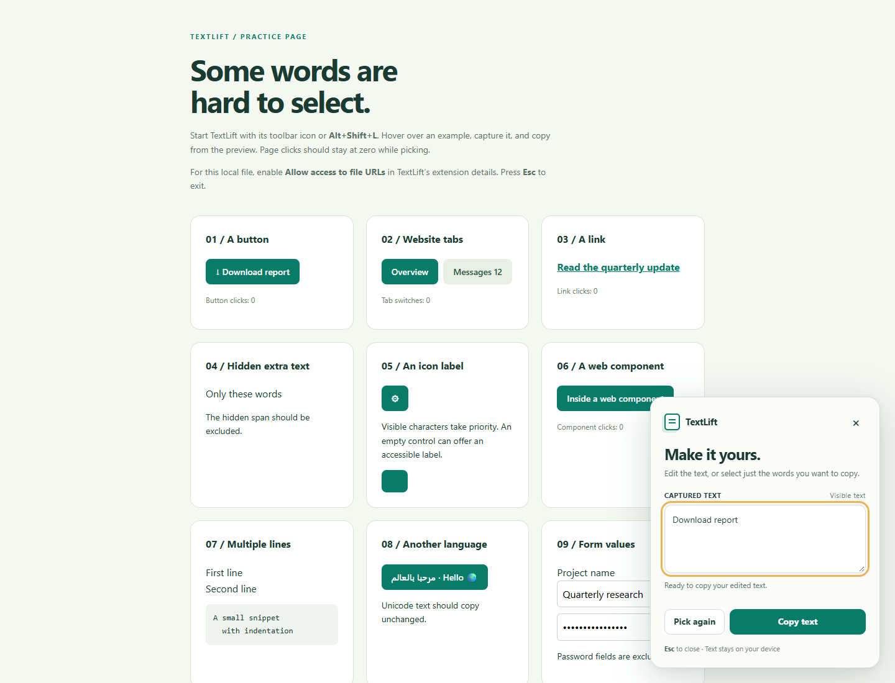

# TextLift

An on-demand Chrome extension for copying text from buttons, website tabs, links, and labels that are difficult to select.

Activate the picker, point at an element, and click to capture its text. Edit the preview or select a few words, then copy them without activating the original button or link.



## Features

- Hover outline and live text preview.
- A click shield that pauses page clicks while picking.
- Editable captured text and copying of selected words.
- **Alt+Shift+L** to toggle the picker and **Esc** to close it.
- **Pick again** to capture another element.
- Visible-text extraction, including open Shadow DOM and basic line breaks.
- Accessible-label fallback for controls without visible text.
- Local clipboard copying on both HTTP and HTTPS pages.
- Password-field exclusion and no saved copy history.

## Install in Chrome

1. Download this repository using **Code → Download ZIP** and extract it, or clone it:

   ```sh
   git clone https://github.com/ae-mhd/TextLift.git
   ```

2. Open `chrome://extensions` in Chrome.
3. Turn on **Developer mode** (top right).
4. Click **Load unpacked** and select the extracted or cloned folder containing `manifest.json`.
5. Use Chrome's extensions menu (puzzle icon) to pin **TextLift**.

Requires **Chrome 116 or newer**. There is no build step or dependency installation for the extension. This is a local development installation; the extension has not been published to the Chrome Web Store.

## Use it

- Open an ordinary website. Click the TextLift icon or press **Alt+Shift+L**.
- Hover over a button, tab, link, or label. A green outline and preview show what will be captured.
- Click to capture. The shield prevents the underlying button or link from receiving your click.
- Edit the captured text or select a portion, then click **Copy text** / **Copy selection**. **Ctrl+Enter** (Command+Enter on Mac) also copies from the preview.
- Click **Pick again** for another item. Press **Esc**, click **×**, or invoke the extension again to close.
- After capture, ordinary page interaction resumes. The preview stays open until you close it.

If the shortcut is taken, set a different one at `chrome://extensions/shortcuts`.

## Try the included demo

Open `demo.html` in Chrome. In TextLift's details at `chrome://extensions`, enable **Allow access to file URLs** first. Start the picker and capture the demo button; its click counter should stay at zero. Exit the picker and click the button normally; its counter should increase.

## Permissions and privacy

TextLift has no dependencies, server, account, analytics, network requests, or saved text history.

- `activeTab`: temporary access to the page you explicitly invoke TextLift on.
- `scripting`: inject the picker into that page.
- `clipboardWrite`: copy only text you choose; the extension never reads the clipboard.
- `offscreen`: a short-lived extension document performs copying, including on HTTP pages. Its text is cleared after every copy and the document is closed.

Text is used only for the hover preview, captured preview, and requested clipboard write. The picker is an extension content script with an isolated JavaScript environment; the preview uses a Shadow DOM to keep page styles from changing its controls. Text is inserted as text, never evaluated as HTML or code.

## Version 1 scope

Requires Chrome 116+. Supports ordinary rendered HTML text, form values except password fields, and open Shadow DOM. Icon-only controls can offer an accessible label, marked separately in the preview. It preserves basic paragraph breaks and normalizes whitespace.

No OCR, embedded iframe support, closed Shadow DOM access, selection-unlock toggle, right-click menu, copy history, or browser-tab-title command is included in this version. CSS-generated words and unusual visual styling can differ from the extracted text; review the preview before copying.

Chrome prevents injection on its internal pages, the Web Store, and some built-in viewers. Open a normal website instead. If you reload the extension while its picker is active, refresh the website before starting again. Local files require the separate file-access toggle.

## Validation

Version 1 passed **25 automated checks** in Chrome on Windows, including actual clipboard copy/paste, button and link suppression, editable previews, selected text, Unicode, HTTP pages, modal dialogs, and narrow viewports. See [TESTING.md](TESTING.md) for the recorded checks and their limits.

The included `demo.html` supports manual testing with click counters and a paste field.

## Source files

- `manifest.json`: Manifest V3 configuration and shortcut.
- `background.js`: on-demand injection and serialized clipboard requests.
- `extract.js`: visible-text extraction and target choice.
- `picker.js`: shield, outline, preview, editing, and cleanup.
- `offscreen.html` / `offscreen.js`: clipboard document.
- `guide.html`, `guide.css`, `guide.js`: options/help page.
- `demo.html`: manual test page with click counters and difficult text.
- `docs/preview.png`: screenshot of the extension in use.

There is no build step. After modifying source, click **Reload** on the extension card and refresh the website. Chrome's extension card also shows any runtime errors.
